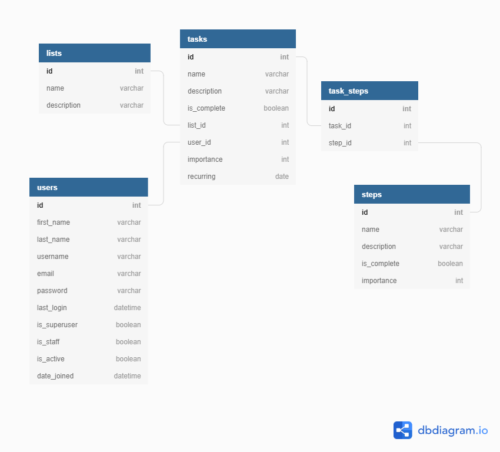

# Domino
This is the Django REST API for Domino

## How to run Domino

1. Clone down the repo and `cd` into it
1. Set up your virtual environment:
   `python -m venv dominoEnv`
1. Activate virtual environment:
   `source ./dominoEnv/bin/activate`
1. Install dependencies:
   `pip install -r requirements.txt`
1. Create a Superuser:
   `python manage.py createsuperuser`
1. Run migrations:
   `python manage.py makemigrations dominoapi`
   `python manage.py migrate`
1. Load fixture data into database:

1. Start the Server:
   `python manage.py runserver`

## ERD
